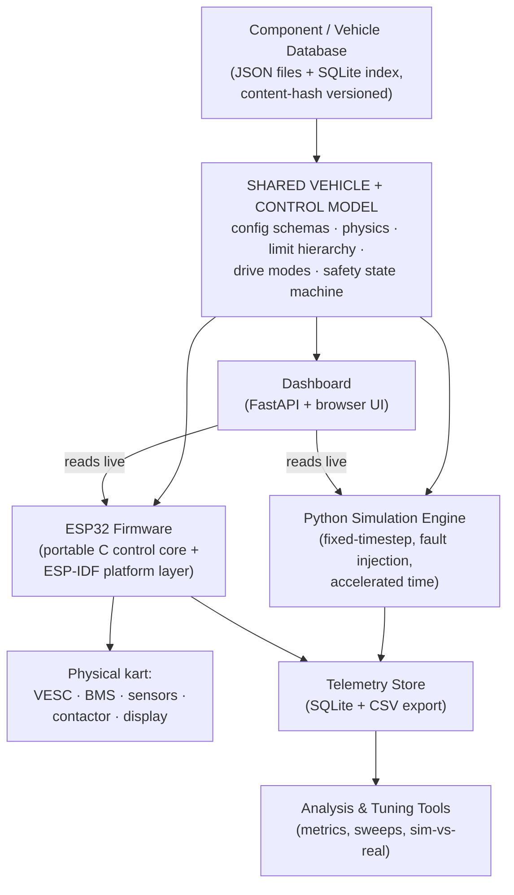
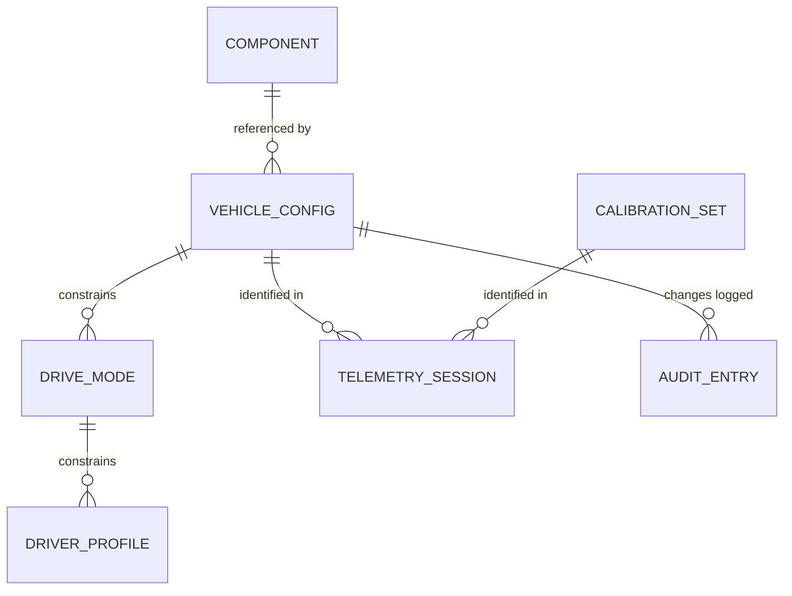

# Electric Go-Kart Software — Architecture

Version: 1.0
Date: 2026-08-09
Source requirements: `Electric Go-Kart Software — Requirements Specification.docx` (v1.1)
Companion document: `docs/IMPLEMENTATION_PLAN.md`

This document defines **what to build and how the pieces fit together**. The
implementation plan defines **the order to build it in**. If the two ever
conflict, this document wins for design questions and the plan wins for
sequencing questions.

---

## 1. Design Mandate (non-negotiable)

From the requirements spec, Section 21:

> Do not build three independent applications. Build a shared,
> configuration-driven vehicle model and control architecture. Python
> simulation, ESP32 firmware, and the dashboard act as different interfaces to
> that underlying model wherever practical.

Concretely, this means:

1. **One configuration format.** A single, schema-validated vehicle
   configuration is the authoritative description of the kart. The simulator,
   firmware, and dashboard all consume it (or artifacts derived from it).
   Nothing hard-codes V1 or V2 numbers.
2. **One control/safety logic definition.** The limit hierarchy, drive-mode
   arbitration, throttle mapping, traction limiter, and safety state machine
   are defined once as **pure, deterministic functions** with explicit
   inputs/outputs. Python is the reference implementation; the ESP32 port is
   verified against shared **golden test vectors** (Section 12).
3. **One telemetry schema.** Simulated and real telemetry use the same channel
   names, units, and session metadata, so the analysis tools cannot tell them
   apart except by a `source` field.
4. **SI units everywhere internally.** m, m/s, m/s², N, N·m, W, Wh (energy
   storage/consumption), V, A, °C (temperature is the one deliberate
   non-Kelvin choice), kg, rad/s. Display conversion (km/h, etc.) happens only
   in presentation layers.

---

## 2. System Overview



The **shared model** is a Python package (`gokart`) containing data schemas
and pure logic. The simulator, dashboard, and analysis tools import it
directly. The firmware cannot run Python, so the safety/limits/control subset
is ported to portable C99 (`firmware/core_c/`) and held equivalent by golden
test vectors generated from the Python reference implementation.

---

## 3. Technology Choices

| Area | Choice | Rationale |
|---|---|---|
| Shared model + simulation | Python 3.12+, `pydantic` v2, `numpy` (analysis only) | Fast to develop, excellent validation, unit-testable |
| Package / env management | `uv` with `pyproject.toml` | Fast, reproducible, single-file config |
| Config storage | JSON files on disk, content-hash (SHA-256) versioned | Human-readable, diffable, git-friendly; no DB migration pain for config data |
| Telemetry + audit storage | SQLite (stdlib `sqlite3`) + CSV export | Required by spec; zero external services; offline-capable |
| Dashboard | FastAPI + WebSocket + static HTML/JS (no build step) | Simple, works on any PC/tablet browser, no Node toolchain to maintain |
| Plotting / reports | `matplotlib` + HTML report generation | Meets "PDF or HTML" report requirement via HTML first |
| Firmware | PlatformIO project, ESP-IDF framework (FreeRTOS), C/C++ | Deterministic tasks, watchdog, TWAI (CAN) support built in |
| Portable control core | C99, no heap, no OS deps, single-precision float | Compiles for ESP32 and for host tests; ESP32 FPU is single-precision |
| CAN definitions | DBC file (`shared/can/gokart.dbc`) + `cantools`/`python-can` on PC side | One source of truth for message layout across sim, HIL, firmware |
| Tests | `pytest` (Python), Unity or plain C test runner (C core), golden vectors (cross-language) | Spec requires safety logic testable without hardware |

Everything runs offline. No cloud services, no internet dependency at runtime.

---

## 4. Repository Layout

```
GoKartApp/
├── README.md
├── docs/
│   ├── ARCHITECTURE.md            ← this file
│   └── IMPLEMENTATION_PLAN.md
├── pyproject.toml                 # Python project (package: gokart)
├── src/gokart/
│   ├── config/                    # schemas, validation, store, versioning, audit
│   │   ├── schemas/               # pydantic models: components, vehicle, modes, profiles, calibration
│   │   ├── store.py               # load/save/list configs, content hashing
│   │   ├── validation.py          # cross-component + limit-hierarchy validation
│   │   └── audit.py               # append-only change log
│   ├── limits/                    # effective-limit resolver (hardware ≥ vehicle ≥ mode ≥ driver)
│   ├── control/                   # throttle map, torque request, traction limiter, control step
│   ├── safety/                    # fault registry, state machine (pure functions)
│   ├── physics/                   # motor, battery, drivetrain, tyres, brakes, thermal, accessories, vehicle
│   ├── sim/                       # simulation engine, scenarios, fault injection, time control
│   ├── telemetry/                 # channel schema, ring buffer/bus, recorder, SQLite/CSV storage, sessions
│   ├── analysis/                  # metrics, acceleration/range/hill tests, parameter sweeps, sim-vs-real
│   ├── dashboard/                 # FastAPI app + static/ UI assets
│   └── drivers/                   # hardware abstraction: interfaces + vesc/, bms/, mock/
├── firmware/
│   ├── core_c/                    # portable C99 control core (shared logic port)
│   │   ├── include/gokart_core/
│   │   ├── src/
│   │   └── tests/                 # host-runnable C tests incl. golden vector runner
│   └── esp32/                     # PlatformIO ESP-IDF project (links core_c)
├── shared/
│   ├── schemas/                   # exported JSON Schema (generated from pydantic)
│   ├── can/gokart.dbc             # CAN message definitions
│   └── golden/                    # cross-language golden test vectors (JSON)
├── data/
│   ├── components/                # reusable component records (JSON)
│   ├── vehicles/                  # vehicle configurations (JSON)
│   ├── drive_modes/               # drive mode definitions (JSON)
│   └── driver_profiles/           # driver profiles (JSON)
├── telemetry/                     # runtime output: sessions.sqlite, CSV exports (gitignored)
└── tests/                         # pytest suite mirroring src/gokart/
```

---

## 5. Configuration System (the data backbone)

### 5.1 Entities



- **Component record** (`data/components/<type>/<id>.json`): one physical part
  — motor, controller, battery pack, BMS, tyre, wheel, brake, DC-DC, sensor,
  contactor. Stores manufacturer, model, part number, specifications,
  datasheet path, source, price, date added, notes. Component records carry
  the **hardware absolute limits**.
- **Vehicle configuration** (`data/vehicles/<name>/<version>.json`): vehicle
  parameters (masses, geometry, aero, rolling resistance, speed/accel limits)
  plus references to component records **by id + content hash**, plus
  vehicle-level configurable limits.
- **Drive mode** and **driver profile**: named limit sets (max speed, battery
  current, motor current, acceleration, throttle response curve, regen
  strength, power, RPM, gradient). Profiles add authentication metadata
  (PIN/RFID/key — mechanism is an extension point, PIN first).
- **Calibration set**: sensor calibration values (throttle/brake ADC endpoints
  and deadbands, wheel-speed pulses per revolution, voltage/current/temperature
  scaling, steering centre). Stored **separately** from vehicle config,
  versioned the same way.

### 5.2 Schema and validation

Pydantic v2 models in `src/gokart/config/schemas/` are the **single source of
truth** for structure and units. JSON Schema is exported to `shared/schemas/`
for tooling and documentation. Every numeric field name encodes its SI unit
(`mass_kg`, `max_speed_mps`, `wheel_radius_m`, `peak_current_a`,
`max_temp_c`) so unit errors are visible at the field level.

Validation layers, all of which must pass before a config is accepted:

1. **Field validation** — types, ranges, required fields (pydantic).
2. **Intra-component sanity** — e.g. peak current ≥ continuous current,
   max voltage ≥ nominal voltage.
3. **Cross-component compatibility** — battery max voltage ≤ controller max
   voltage; motor max RPM vs gearing vs vehicle max speed consistency; BMS
   discharge limit vs controller battery-current setting.
4. **Limit hierarchy** (Section 6) — vehicle limits ≤ hardware absolute
   limits; mode limits ≤ vehicle limits; profile limits ≤ mode limits.

Rejected changes return a machine-readable list of violations, each with the
offending field, the constraint, and the limiting value — the spec requires
rejections to "clearly state the reason".

### 5.3 Versioning, hashing, audit

- A configuration file is **immutable once referenced by a telemetry
  session**. Changes create a new semantic version (`V1.1`, `V2.0`) in a new
  file.
- Every saved config gets a **SHA-256 content hash** computed over its
  canonical JSON form (sorted keys, normalized floats). The hash is the
  tamper-evident identity; the version string is the human name.
- `audit.py` maintains an append-only log (SQLite table): timestamp, actor,
  entity, from-hash, to-hash, field-level diff summary, validation result.

---

## 6. Limit Hierarchy Resolver

The strictly enforced hierarchy (spec Section 9):

```
hardware absolute limits   (from component records — immutable by software)
  ≥ vehicle configuration limits
    ≥ drive-mode limits
      ≥ driver-profile limits
```

`src/gokart/limits/resolver.py` provides one pure function used by both the
validator (at config time) and the control loop (at run time):

```python
@dataclass(frozen=True)
class EffectiveLimits:
    max_speed_mps: float
    max_motor_current_a: float
    max_battery_current_a: float
    max_regen_current_a: float
    max_power_w: float
    max_motor_rpm: float
    max_accel_mps2: float
    max_decel_mps2: float

def resolve_limits(
    hardware: HardwareLimits,      # min() across motor/controller/battery/BMS records
    vehicle: VehicleLimits,
    mode: DriveModeLimits,
    profile: DriverProfileLimits,
    derating: DeratingFactors,     # thermal/SOC derating, 0.0–1.0 per channel
) -> EffectiveLimits: ...
```

Rules:

- Each field of the result is the **minimum** across the four layers,
  multiplied by the applicable derating factor.
- `hardware` is itself the minimum of the motor, controller, battery, and BMS
  limits for each quantity — the spec requires "the minimum of motor,
  controller, battery, and BMS limits at every step".
- Derating (from thermal model or low SOC) can only reduce, never raise.
- This function is part of the **portable core** (Section 12): it is
  reimplemented in C and covered by golden vectors.

---

## 7. Control Pipeline

One deterministic step, executed at the control rate (100 Hz in sim and on
ESP32). Pure function, no I/O, no globals:

```python
def control_step(
    inputs: ControlInputs,      # throttle 0–1, brake 0–1, speed, motor rpm, currents, temps, voltages
    limits: EffectiveLimits,
    safety: SafetyOutputs,      # from safety state machine: drive enabled? torque scale?
    state: ControlState,        # traction limiter state, filtered signals
    params: ControlParams,      # throttle curve, regen config, traction thresholds
) -> tuple[ControlOutputs, ControlState]:
```

Pipeline inside the step:

1. **Input conditioning** — apply calibration, clamp, rate-limit throttle per
   mode's throttle-response setting.
2. **Safety gate** — if the safety state machine says torque is not permitted,
   output zero torque request (and regen only if permitted).
3. **Throttle → torque request** — configurable curve (linear / progressive),
   scaled to the mode's power/torque budget.
4. **Traction limiter** — compare motor-RPM-implied speed against measured
   vehicle speed; if slip ratio exceeds threshold, temporarily scale torque
   down, recover with hysteresis. (Spec calls this a "high-value early
   feature".)
5. **Limit clamp** — clamp resulting torque/current so motor current, battery
   current, power, RPM, and speed limits in `EffectiveLimits` are all
   respected (speed limit implemented as torque taper approaching max speed,
   not a hard cut).
6. **Regen arbitration** — map brake input to regen torque, clamped by regen
   current limit and battery charge-current limit; mechanical brake model
   handles the remainder (in sim).

`ControlOutputs` = torque/current command to send to the motor controller +
diagnostic values for telemetry. This entire pipeline is portable-core logic
(Python reference + C port + golden vectors).

---

## 8. Safety State Machine and Fault Handling

### 8.1 States

```
OFF → BOOT → SELF_TEST → READY → ARMED → DRIVING
                             ↘      ↘       ↘
                              FAULT ←────────┘
                                │
                          SAFE_SHUTDOWN → OFF
```

| State | Meaning | HV contactor | Torque allowed |
|---|---|---|---|
| OFF | System unpowered / logic idle | Open | No |
| BOOT | Firmware/sim initialising, config loading | Open | No |
| SELF_TEST | Power-on self-test: sensors in range, CAN alive, VESC/BMS responding, brake/throttle plausibility | Open | No |
| READY | Tests passed, waiting for arm request (driver authenticated, brake pressed) | Open | No |
| ARMED | Precharge sequence complete, contactor closed | Closed | No (zero torque) |
| DRIVING | Normal operation | Closed | Yes |
| FAULT | A fault requiring stop; torque zeroed; recoverable faults allow return to READY after clear | Depends on severity | No |
| SAFE_SHUTDOWN | Controlled ramp-down, contactor opened, state persisted | Opening → Open | No |

### 8.2 Fault model

A central fault registry (`src/gokart/safety/faults.py`) defines every fault
with: id, description, detection condition, severity, latching behaviour, and
required action. Severities:

- **WARNING** — log + display, no behaviour change.
- **DERATE** — reduce limits via `DeratingFactors` (e.g. motor temp high).
- **FAULT** — zero torque, transition to FAULT; recoverable after condition
  clears and driver acknowledges.
- **CRITICAL** — immediate SAFE_SHUTDOWN, contactor open, latched until
  power cycle.

Minimum fault set (from spec Section 10): throttle signal out of
range/implausible, brake sensor fault, throttle+brake simultaneous
(plausibility), wheel-speed sensor fault, sensor disagreement, CAN timeout,
VESC fault codes, BMS fault codes, pack over/under-voltage, cell
over/under-voltage, motor/controller/battery over-temperature, overspeed,
MCU watchdog reset detected, contactor feedback mismatch, precharge failure.

### 8.3 Contract

The state machine is a pure transition function — portable-core logic:

```python
def safety_step(
    state: SafetyState,
    inputs: SafetyInputs,        # sensor validity, fault flags, arm/disarm requests, speed
    config: SafetyConfig,        # thresholds, timeouts, self-test requirements
    timers: SafetyTimers,
) -> tuple[SafetyState, SafetyOutputs, SafetyTimers]:
```

`SafetyOutputs` carries: torque permitted (bool), regen permitted (bool),
contactor command (open/close/precharge), derating factors, active fault list,
display message code.

### 8.4 Hardware independence

Software shutdown is **not** the only protection (spec requirement). The
architecture assumes and documents hardware interlocks: physical e-stop in the
contactor coil path, BMS-controlled disconnect, and the ESP32 watchdog. The
firmware treats these as facts it must tolerate (e.g. contactor opened
externally → detect via feedback, enter FAULT), never as functions it owns
exclusively.

### 8.5 Fault injection

The simulator can inject any registered fault at a scheduled time or
condition (Section 10.3 of the plan). Every FAULT/CRITICAL entry in the
registry must have at least one injection test that proves the correct state
transition and output. This is mandatory per the spec.

---

## 9. Physics Engine

Fixed-timestep (default 10 ms), longitudinal point-mass model. Each component
model is a small class with `step(dt, inputs) -> outputs` and explicit state.
No component talks to another directly; `vehicle.py` composes them so the
data flow is auditable:

```
torque request (from control pipeline)
  → MotorModel: available torque at current RPM & voltage (map or nameplate
    fallback), electrical power draw, efficiency, heat
  → DrivetrainModel: gear ratio + chain/axle efficiency → wheel torque;
    also kinematic path: motor RPM ↔ wheel RPM ↔ vehicle speed (must stay
    consistent — one ratio constant used by both paths)
  → TyreModel: tractive force limited by µ·load (simple friction circle,
    longitudinal only for MVP)
  → Force balance: F_tractive − F_aero − F_rolling − F_gradient − F_brake
  → a = F_net / m_total ; integrate v, x  (semi-implicit Euler)
  → BatteryModel: equivalent circuit — OCV(SOC) lookup + R_internal(SOC, T);
    computes pack voltage under load (sag), current, SOC integration
    (coulomb counting), heat generation, remaining energy, range estimate
  → ThermalModel (motor, controller, battery): single thermal mass each,
    P_heat in, convective loss out, temperature state
  → AccessoryModel: constant + switchable low-voltage loads via DC-DC
    efficiency → adds to battery current draw; flags brown-out risk if pack
    voltage under load < DC-DC minimum input
```

Notes:

- **Motor model preference order** (spec 5.1): CSV torque/efficiency map if
  provided, else nameplate continuous/peak + constant efficiency.
- **Limits are enforced by the control pipeline**, not the physics. Physics
  models what the hardware *would* do; control decides what is *requested*.
  The one exception: physical saturation (e.g. motor can't exceed its
  torque-speed envelope) lives in physics.
- Battery model is equivalent-circuit + thermal mass **only** — the spec
  explicitly rules out electrochemical models for early releases.
- Brakes: mechanical braking force and regen are separate paths, combined in
  the force balance; regen respects battery charge-current limit.

---

## 10. Simulation Engine

`src/gokart/sim/engine.py` runs the loop:

```
for each tick (dt = 10 ms):
    scenario → driver inputs (throttle, brake) + environment (gradient, surface, ambient temp)
    fault injector → override sensor values / inject fault flags
    safety_step(...)            # shared logic
    resolve_limits(...)         # shared logic (with current derating)
    control_step(...)           # shared logic
    vehicle.step(...)           # physics
    telemetry.emit(tick_record) # same schema as firmware telemetry
```

- **Scenarios** are data (JSON/YAML): sequences of driver input vs time or vs
  distance, plus environment. Standard scenarios ship in the repo: full
  throttle standing start, hill climb, duty-cycle range test, throttle/brake
  replay from a recorded session.
- **Time control**: real-time (paced to wall clock, feeds live dashboard) or
  accelerated (as fast as CPU allows, for range runs) — same code path, only
  the pacing differs.
- **Replay**: a recorded telemetry session's throttle/brake traces can be used
  as a scenario, enabling the measured-vs-predicted comparison loop.

---

## 11. Telemetry, Sessions, and Storage

- **Channel schema** (`src/gokart/telemetry/channels.py`): the canonical list
  of channels with name, SI unit, and type — timestamp, speed, motor RPM,
  throttle, brake, torque request/actual, motor/battery currents, pack
  voltage, SOC, temperatures (motor/controller/battery), drive mode, safety
  state, active faults, acceleration, regen power, GPS (nullable). Simulated
  and real sessions use identical channels plus `source: sim | kart`.
- **Session metadata**: session id (UUID), start/end time, vehicle config
  version **and content hash**, calibration set hash, firmware version,
  driver profile, drive mode(s) used, start/end SOC, notes.
- **Storage**: SQLite database (`telemetry/sessions.sqlite`) with `sessions`
  and `samples` tables; CSV export per session for simple inspection.
  Sampling rate configurable (default 50 Hz log rate from the 100 Hz loop).
- **Live path**: an in-process pub/sub bus; the dashboard subscribes via
  WebSocket bridge. On the kart, the ESP32 streams the same records over
  Wi-Fi/serial to whatever is recording. Telemetry is strictly best-effort:
  loss of the telemetry path must never affect the control/safety loop
  (non-functional requirement: recoverability).

---

## 12. Firmware Architecture (ESP32) and the Portable Core

### 12.1 Portable core strategy — how "one logic" is achieved

The safety state machine, limit resolver, control pipeline, and throttle/regen
mapping are written twice but **defined once**:

1. **Python reference implementation** in `src/gokart/{safety,limits,control}`
   — developed first, unit-tested exhaustively.
2. **Golden test vectors** in `shared/golden/*.json` — generated by a script
   from the Python implementation: thousands of (input state → expected
   output) cases including boundary and fault conditions.
3. **C99 port** in `firmware/core_c/` — no heap, no floating-point doubles,
   no OS calls; a host-compiled test runner must reproduce every golden
   vector bit-for-bit within stated float tolerance (1e-5 relative).

CI order is therefore: Python tests → regenerate vectors → C tests. A change
to control logic that isn't reflected in both implementations fails the
vector suite. This satisfies "the same logic can be unit-tested in Python and
faithfully implemented on the ESP32" without cross-compilation tricks.

### 12.2 Firmware task layout (ESP-IDF / FreeRTOS)

| Task | Rate / trigger | Priority | Responsibility |
|---|---|---|---|
| `control_task` | 100 Hz timer | Highest | Read latest sensor snapshot → `safety_step` → `resolve_limits` → `control_step` → command VESC. Feeds hardware watchdog. |
| `can_task` | On CAN RX + 50 Hz TX | High | VESC/BMS frames in/out via TWAI; updates sensor snapshot; detects timeouts. |
| `sensor_task` | 200 Hz | High | ADC throttle/brake, wheel-speed pulse counting, applies calibration. |
| `telemetry_task` | 50 Hz | Low | Serialise tick records; write to SD/flash ring buffer; stream if link available. |
| `display_task` | 10 Hz | Low | Push speed/mode/SOC/fault to the driver display. |
| `config_task` | On demand | Low | Load vehicle config + calibration from NVS/SD at boot; accept updates only when stationary and in READY/OFF. |

Rules baked into the firmware design:

- **Hard upper bounds** (compile-time constants mirroring hardware absolute
  limits) clamp everything as a final backstop, regardless of configuration
  content.
- Control/safety never blocks on telemetry, display, or Wi-Fi (determinism +
  recoverability requirements).
- Watchdog: hardware task watchdog on `control_task`; a missed deadline →
  reset → BOOT detects the reset reason → FAULT state.
- Contactor/precharge sequencing is owned by the safety outputs
  (`SafetyOutputs.contactor_command`), executed by a GPIO driver with
  feedback verification.

### 12.3 Driver abstraction

`src/gokart/drivers/` (Python) and the firmware mirror the same interface
concept:

```python
class MotorControllerDriver(Protocol):
    def read_status(self) -> ControllerStatus: ...   # rpm, currents, voltage, duty, temps, faults
    def set_current(self, amps: float) -> None: ...
    def set_current_limits(self, motor_a: float, battery_a: float) -> None: ...

class BmsDriver(Protocol):
    def read_status(self) -> BmsStatus: ...          # pack V/A, SOC, cell voltages, temps, faults
```

Implementations: `vesc/` (VESC CAN protocol), `bms/` (target BMS protocol),
`mock/` (returns simulated values — used by the simulator and by HIL level 1).
Protocol details never leak past these modules. The DBC file defines all
frame layouts; PC-side code parses it with `cantools`, firmware uses
generated/handwritten structs kept in sync with the DBC (checked by a test
that round-trips example frames).

---

## 13. Dashboard

Two distinct consumers, one data source:

1. **Development/virtual dashboard** (MVP): FastAPI app serving a static
   HTML/JS page. WebSocket pushes live telemetry records. Driving view
   renders, in priority order: large speed (km/h), drive mode, SOC bar, fault
   banner, power. Additional tabs (available when the vehicle/sim is
   stationary): configuration browser, diagnostics/live channels, trip
   history. All unit conversion happens here.
2. **Physical driver display**: driven directly by the ESP32 `display_task`
   over serial/SPI to a hardware display. Same five priority items. Never
   depends on the FastAPI app existing — the kart is fully functional with
   only the hardware display (offline-operation requirement).

The web dashboard reads from the telemetry bus, so it works identically
whether the producer is the simulator or the real kart streaming over Wi-Fi.

---

## 14. Analysis & Virtual Tuning

`src/gokart/analysis/` builds on stored sessions and on directly-driven
simulations:

- **Standard performance tests** (each a scenario + metric extractor):
  acceleration times to 10/20/30/40/50 km/h, theoretical vs practical top
  speed, hill climb (user gradient + distance), range under configurable duty
  cycles per drive mode.
- **Virtual tuning**: run the same scenario against two config versions and
  produce a side-by-side diff of metrics.
- **Parameter sweeps**: grid sweep over declared parameter ranges (e.g.
  sprocket teeth 10–16 × 48–60) with user-defined objective and constraints;
  results table sorted by objective. Simple combinatorial only — no fancy
  optimisers in early releases (per spec).
- **Sim vs real**: given a real session, replay its throttle/brake through
  the simulator with the same config version, overlay traces, compute error
  metrics per channel; expose model parameters (e.g. rolling resistance,
  effective mass, motor efficiency scale) for manual calibration adjustment,
  stored as a named calibration overlay on the config.
- **Reports**: HTML report per analysis (plots + config hash + metric tables).

---

## 15. Hardware-in-the-Loop Progression

Three levels, matching the spec:

1. **SIL**: PC simulator exposes a virtual CAN bus (SocketCAN on Linux /
   `python-can` virtual bus elsewhere) speaking the DBC-defined messages. Any
   CAN-speaking client sees a "real" kart.
2. **HIL level 1**: ESP32 running real firmware connected via a USB-CAN
   adapter to the PC simulator, which plays the roles of VESC and BMS. Fault
   injection now exercises real firmware.
3. **HIL level 2 / real**: real throttle → ESP32 → real VESC → real motor.
   Simulator drops out; telemetry pipeline unchanged.

Because sim, firmware, and drivers all speak the same DBC and telemetry
schema, each level is a wiring change, not a software change.

---

## 16. Extension Points (design for, don't build)

Explicitly reserved, per spec Section 18: GPS/geofencing (GPS channels
already nullable in telemetry schema), phone app (dashboard is already a web
client — a phone browser works), BLE/Wi-Fi provisioning, OTA updates
(firmware partition scheme should reserve an OTA slot from day one — cheap
now, painful later), lap timing, cloud sync (telemetry store is
export-friendly), multi-vehicle (config store is already keyed by vehicle
name), advanced cell-level battery health.

---

## 17. Key Decisions (ADR summary)

| # | Decision | Alternatives considered | Why |
|---|---|---|---|
| 1 | Python reference + C99 port + golden vectors for shared logic | Single C core wrapped for Python via cffi | Golden vectors are simpler to build/maintain, keep Python development friction-free, and still guarantee equivalence; cffi build adds toolchain pain for little gain at this scale |
| 2 | JSON files + content hash for configs; SQLite only for telemetry/audit | Everything in SQLite | Configs benefit from being diffable/git-trackable text; telemetry is high-volume tabular data where SQLite shines |
| 3 | FastAPI + vanilla JS dashboard, no frontend build step | React/Vite SPA | Minimises toolchain surface for the implementing model; the UI is gauges + charts, not a complex app |
| 4 | ESP-IDF (via PlatformIO) over Arduino framework | Arduino-ESP32 | Need FreeRTOS task control, TWAI driver, task watchdog, OTA partitioning — first-class in IDF |
| 5 | Semi-implicit Euler @ 100 Hz for physics | RK4, variable step | Adequate accuracy for longitudinal dynamics at this timestep; trivially portable; deterministic |
| 6 | Limits enforced in control layer, saturation in physics | Enforce in physics | Keeps "what hardware does" separate from "what software requests", which is exactly the sim/firmware split |
| 7 | °C for temperatures, otherwise strict SI | Kelvin | Every datasheet and human uses °C; conversion risk outweighs purity |
